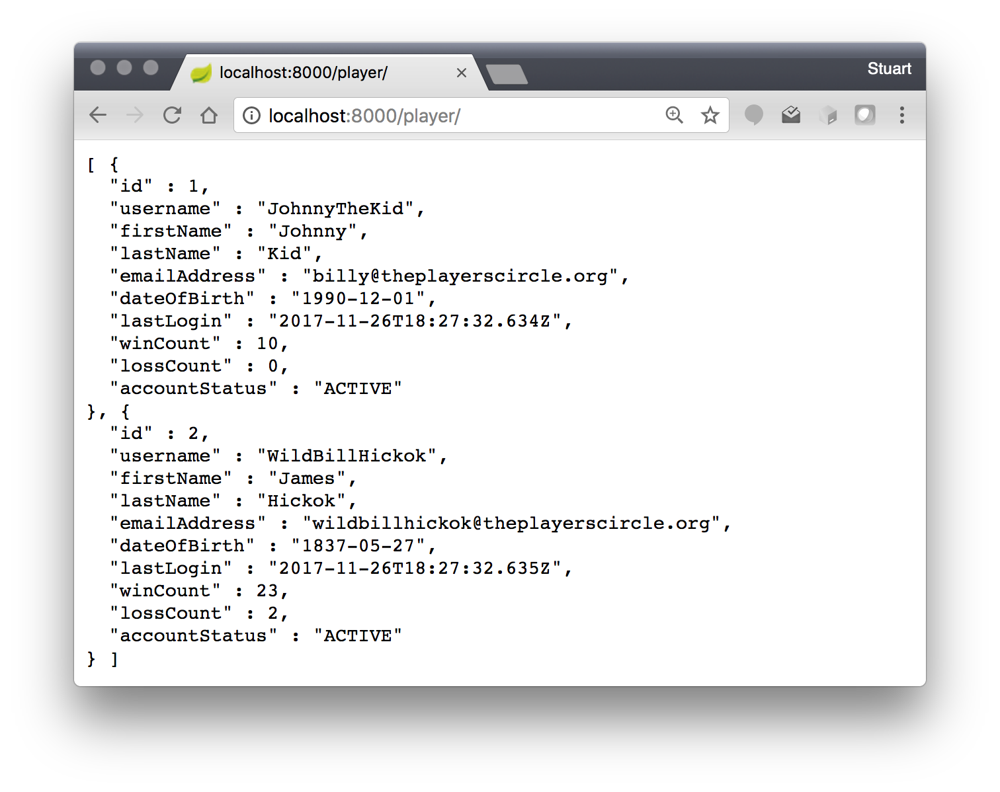
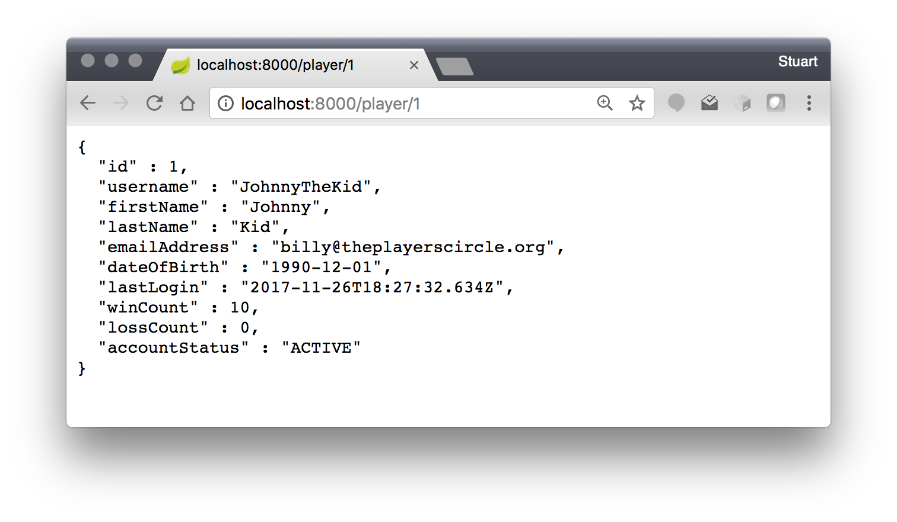

## Cloud Poker

A simple spring boot application to allow multiple pairs of players to play poker online.


## Running

In a terminal or CMD window (Windows), cd to project directory

```bash

$ cd <path_to_project>/cloud-poker

```

to run the project:

```bash

$ ./gradlew clean bootRun

```

you should see logging similar to:

```

  .   ____          _            __ _ _
 /\\ / ___'_ __ _ _(_)_ __  __ _ \ \ \ \
( ( )\___ | '_ | '_| | '_ \/ _` | \ \ \ \
 \\/  ___)| |_)| | | | | || (_| |  ) ) ) )
  '  |____| .__|_| |_|_| |_\__, | / / / /
 =========|_|==============|___/=/_/_/_/
 :: Spring Boot ::        (v1.5.8.RELEASE)

2017-11-26 13:17:30 [restartedMain] INFO  c.i.cloudpoker.CloudPokerApplication - Starting CloudPokerApplication on osxeuropa with PID 19266 (/Users/smackenzie/code/cloud-poker/build/classes/main started by smackenzie in /Users/smackenzie/code/cloud-poker)
2017-11-26 13:17:30 [restartedMain] DEBUG c.i.cloudpoker.CloudPokerApplication - Running with Spring Boot v1.5.8.RELEASE, Spring v4.3.12.RELEASE
2017-11-26 13:17:30 [restartedMain] INFO  c.i.cloudpoker.CloudPokerApplication - No active profile set, falling back to default profiles: default
2017-11-26 13:17:35 [restartedMain] INFO  c.i.cloudpoker.CloudPokerApplication - Started CloudPokerApplication in 5.873 seconds (JVM running for 6.464)
<==========---> 83% EXECUTING
```

#### Verification

Open your web browser and point to:
http://localhost:8000/player/

this will list the 2 players initialized in the tmp data store.




Adding a player id to the URL will display that specific user.

http://localhost:8000/player/1



## Recent Changes
* Update project to use `gradle` vs `maven`
* The persistence layer is using an in memory HashTable (`PlayerRepositoryInMemoryImpl`) for now until we set up a DB.
